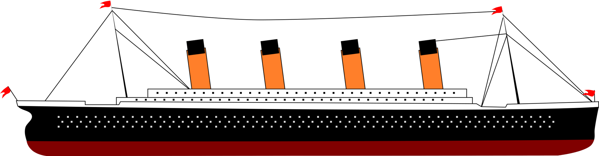

# Titanic Challenge

Welcome to the Titanic Survival Prediction Challenge! This project is aimed at predicting the survival of passengers on the Titanic using machine learning models. Below you'll find a detailed overview of the project, including data preprocessing, feature engineering, model training, evaluation, and results.

## 📊 Exploratory Data Analysis (EDA)

The initial data analysis involved examining the Titanic dataset to uncover patterns and insights. We focused on:
- Handling missing values
- Understanding the distribution of features
- Visualizing relationships between features and survival

## 🔧 Feature Engineering

Key steps in feature engineering included:
- Removing non-contributory columns like `Name` and `Ticket`
- Filling missing values in `Age` with the mean age
- Replacing missing values in `Cabin` with the most frequent value and simplifying the data
- Converting categorical variables (`Pclass`, `SibSp`, `Parch`) to string types

## 🧠 Machine Learning Models

We trained several machine learning models to predict survival:
- **Random Forest** 🌲
- **Logistic Regression** 📉
- **K-Nearest Neighbors (KNN)** 📍
- **LightGBM** 💡
- **AdaBoost** 🚀
- **Decision Tree** 🌳
- **Gaussian Naive Bayes** 🧪

**Model Evaluation**

We evaluated models using metrics such as:
- Accuracy
- Precision
- Recall
- F1-Score
- AUC (Area Under the ROC Curve)

The Random Forest model emerged as the best performer with the highest AUC.

## 🛠 Tools and Libraries

- `pandas`
- `numpy`
- `scikit-learn`
- `seaborn`
- `matplotlib`
- `lightgbm`
- `loguru`

